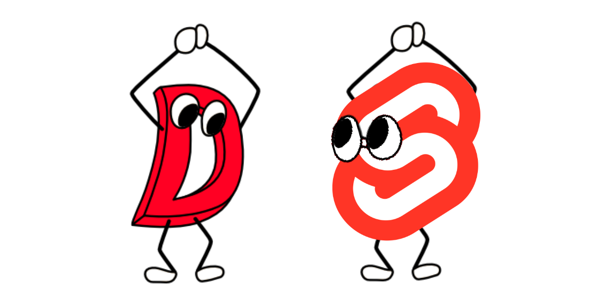

# svelte-vibe.d
Vibe.d (D-Lang) with Svelte! This requires node.js (to build svelte, nothing else) and Dub/Dlang to run. 

## Prerequisites 

Install the needed dependencies in Node.js (we only neeed node to build Svelte via Rollup.JS, this does not run as a server).
```
$ cd svelte && npm i
```

Install the needed dependendices in Dub/Dlang (this is the server backend).

## Running

``` 
$ dub run 
```

That's it! Svelte will automatically be built in nodejs.

## How this works: 

This runs the basic Vibe.d web framework as  core server infrastructure and in the svelte directory you write your code as HTML/JS/CSS as usual with Svelte.js. 

When you run the application the ```main()``` function will automatically execute the svelte build scripts, and transfer the build to the D-lang ```/public``` directory. In D we are reading the static files and passing the req/res for what you need. Sweet cybernetically enhanced front-end, with a sweet low-language @safe(r) compiled language. 

## Why was this built?

I dislike Pug/Jade/Diet templating engines, and love Svelte. This is a method to quickly bootstrap a nice Svelte UI with the greatness that is D-lang. I needed a low-cost, highly productive, low language embedded web view for a project I am working on for [DNX Robotics](https://dnxrobotics.com), this matches all of the requirements needed.

If you don't know what [D Lang](dlang.org) is, it's the next greatest compiled language and has been around a lot longer than you think. 

